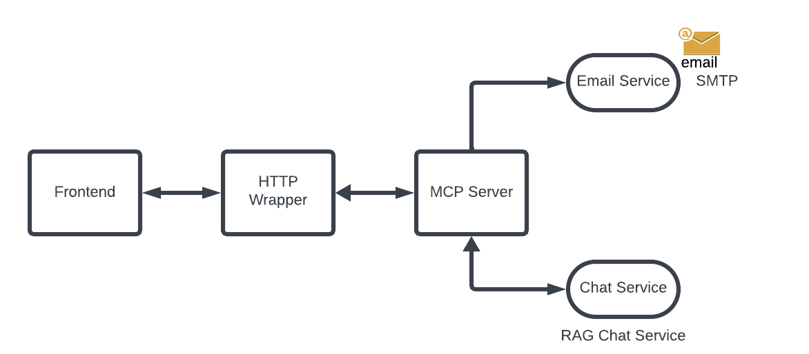
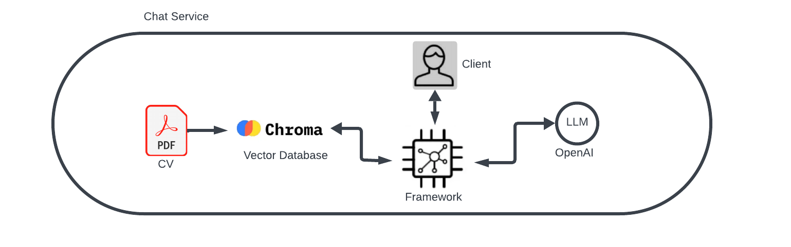

# MCP Server - CV RAG System

A Python-based Retrieval Augmented Generation (RAG) system optimized for CV/resume analysis. This lightweight application processes PDF files and provides an AI-powered question-answering interface through a REST API. It uses OpenAI's embedding and language models to deliver accurate responses about resume content.

## Features

- **PDF Processing**: Automatically processes CV/resume PDF files for AI-powered analysis
- **Vector Storage**: Uses ChromaDB with OpenAI embeddings for efficient semantic search
- **OpenAI Integration**: Leverages OpenAI's embedding and language models for high-quality responses
- **Memory Optimized**: Streamlined architecture designed to run in constrained environments (Render free tier)
- **REST API**: Provides HTTP endpoints with CORS support for frontend integration
- **Email Functionality**: Built-in email capabilities for contact and sharing
- **Docker Support**: Easy deployment with Docker and Render compatibility

## Architecture

### System Overview



For text-based environments, here's the architecture diagram:

### RAG Pipeline Overview



The Retrieval Augmented Generation (RAG) pipeline enhances the AI's responses by:

1. **Retrieval**: Finding relevant information from the CV database
2. **Augmentation**: Combining retrieved context with the user's question
3. **Generation**: Creating accurate, contextually relevant answers

This approach ensures responses are grounded in the actual CV content, reducing hallucinations and improving accuracy.

### Component Details

1. **Document Processing**:

   - PDF parsing with PyPDF
   - Text chunking with RecursiveCharacterTextSplitter
   - Automatic file handling and metadata extraction

2. **Vector Storage**:

   - ChromaDB for efficient vector storage
   - OpenAI text-embedding-3-small model for embeddings
   - Semantic search capabilities

3. **RAG Implementation**:

   - Optimized single initialization of language models
   - Memory-efficient retrieval chain
   - Document context integration with LLM

4. **API Layer**:

   - FastAPI with Pydantic models
   - CORS middleware for frontend integration
   - Structured JSON responses

5. **Email Service**:
   - SMTP integration with Gmail
   - Secure credential management
   - Email sending API endpoint

## Setup

### 1. Create a Virtual Environment

```bash
# For Windows
python -m venv .venv
.\.venv\Scripts\Activate.ps1  # For PowerShell
# OR
.\.venv\Scripts\activate.bat  # For Command Prompt

# For macOS/Linux
python3 -m venv .venv
source .venv/bin/activate
```

### 2. Install Dependencies

```bash
pip install -r requirements.txt
```

### 3. Environment Configuration

Create a `.env` file and configure your API keys:

```
OPENAI_API_KEY=your_openai_api_key_here
EMAIL_USER=your.email@gmail.com
EMAIL_PASSWORD=your_app_password_here  # Gmail App Password
CORS_ORIGINS=*  # Or specific origins separated by commas
```

### 3. Folder Structure

```
MCP-Backend/
├── Data/          # Place CV/resume PDFs here for processing
├── DB/            # Vector database storage (auto-created)
├── ingest.py      # Document ingestion script
├── models.py      # OpenAI model configurations
├── chat.py        # Interactive chat interface
├── mcp_server.py  # MCP server with email tool
├── rest_api.py    # REST API server
├── rag_core.py    # Optimized RAG implementation
└── test_email.py  # Email testing utility
```

## Quick Start Guide

### Running Locally

Follow these steps to run the project locally:

1. **Clone the repository**

   ```bash
   git clone https://github.com/MCP-For-My-CV/MCP-Backend.git
   cd MCP-Backend
   ```

2. **Set up a virtual environment**

   ```bash
   # For Windows PowerShell
   python -m venv .venv
   .\.venv\Scripts\Activate.ps1

   # For macOS/Linux
   python3 -m venv .venv
   source .venv/bin/activate
   ```

3. **Install dependencies**

   ```bash
   pip install -r requirements.txt
   ```

4. **Configure environment variables**

   - Create a `.env` file with your OpenAI API key and email settings

5. **Run the REST API server**

   ```bash
   python rest_api.py
   ```

6. **Access the API**
   - Open your browser to: http://localhost:8000/docs
   - Use the Swagger UI to test the endpoints

### Deployed Version

You can access the deployed version of this project on Render:

**Live Demo**: [https://cv-rag-system.onrender.com](https://cv-rag-system.onrender.com)

## Usage

### Ingesting CV/Resume Documents

```bash
python ingest.py
```

This will:

1. Process any PDF files in the `./Data` folder
2. Convert text into semantically meaningful chunks
3. Generate embeddings using OpenAI's embedding model
4. Store vectors in the ChromaDB vector database
5. Mark processed files with a `_` prefix to avoid reprocessing

### Running the REST API Server

```bash
python rest_api.py
```

This will:

1. Initialize the RAG system with optimized memory usage
2. Start the FastAPI server on port 8000 (configurable via PORT env variable)
3. Make both RAG and email endpoints available

### Interactive Chat Interface

For local testing without a frontend:

```bash
python chat.py
```

### Querying via REST API

Make POST requests to the RAG endpoint:

```bash
curl -X POST "http://localhost:8000/tools/rag" \
     -H "Content-Type: application/json" \
     -d '{"question": "What are my technical skills?"}'
```

Response:

```json
{
  "question": "What are my technical skills?",
  "answer": "Based on your CV, your technical skills include Python, JavaScript, FastAPI, React, Docker, AWS, and data analysis...",
  "timestamp": "2025-09-04 15:22:33",
  "status": "success"
}
```

### Sending Emails

Send emails via the API:

```bash
curl -X POST "http://localhost:8000/tools/email" \
     -H "Content-Type: application/json" \
     -d '{
       "recipient": "employer@company.com",
       "subject": "Job Application Follow-up",
       "body": "Thank you for considering my application. Please find additional information about my qualifications..."
     }'
```

### Testing Email Configuration

Use the provided test script:

```bash
python test_email.py
```

## Deployment

### Memory-Optimized for Cloud Deployment

This application has been specifically optimized for deployment on platforms with memory constraints such as Render's free tier:

- Removed heavy local models (HuggingFace/sentence-transformers)
- Streamlined to use only OpenAI API (cloud-based models)
- Single initialization of components
- Efficient database connections

### Docker Deployment

Build and run with Docker:

```bash
# Build the image
docker build -t cv-rag-system .

# Run with environment variables
docker run -p 8000:8000 \
  -e OPENAI_API_KEY=your_key \
  -e EMAIL_USER=your.email@gmail.com \
  -e EMAIL_PASSWORD=your_app_password \
  cv-rag-system
```

### Deploying to Render

1. Push your repository to GitHub
2. Create a new Web Service on Render
3. Connect your GitHub repository
4. Configure as follows:
   - Environment: Docker
   - Environment Variables:
     - `OPENAI_API_KEY`: Your OpenAI API key
     - `EMAIL_USER`: Your Gmail address
     - `EMAIL_PASSWORD`: Your Gmail App Password
     - `CORS_ORIGINS`: Allowed origins (e.g., your frontend URL)

#### Live Deployment

This project is currently deployed and accessible at:

**[https://cv-rag-system.onrender.com](https://cv-rag-system.onrender.com)**

You can:

- Test the RAG endpoint at `https://cv-rag-system.onrender.com/tools/rag`
- View API documentation at `https://cv-rag-system.onrender.com/docs`
- Check system health at `https://cv-rag-system.onrender.com/health`

## API Reference

### RAG Endpoint

```
POST /tools/rag
```

Request:

```json
{
  "question": "string" // Question about the CV content
}
```

Response:

```json
{
  "question": "string", // Original question
  "answer": "string", // AI-generated answer based on CV
  "timestamp": "string", // ISO format timestamp
  "status": "success" // Status of the request
}
```

### Email Endpoint

```
POST /tools/email
```

Request:

```json
{
  "recipient": "string", // Email recipient
  "subject": "string", // Email subject
  "body": "string" // Email body text
}
```

Response:

```json
{
  "result": "string" // Success message or error
}
```

### Health Check

```
GET /health
```

Response:

```json
{
  "status": "healthy",
  "service": "MCP CV RAG Server"
}
```

## Configuration

### CORS Configuration

Configure CORS in your `.env` file:

```
# Allow all origins
CORS_ORIGINS=*

# Allow specific origins
CORS_ORIGINS=https://your-frontend.com,https://another-app.com
```

### Email Configuration

For Gmail SMTP:

1. Enable 2-Factor Authentication on your Gmail account
2. Generate an App Password (Google Account → Security → App passwords)
3. Add to your `.env` file:
   ```
   EMAIL_USER=your.email@gmail.com
   EMAIL_PASSWORD=your16characterapppassword
   ```

### Model Configuration

The system is configured to use OpenAI's models:

- **Embeddings**: text-embedding-3-small (most efficient embedding model)
- **Language Model**: gpt-3.5-turbo (fast, cost-effective)

## Technical Details

### Dependencies

Current essential dependencies:

- `python-dotenv`: Environment variable management
- `langchain`: RAG framework
- `langchain-community`: Document loaders
- `langchain-chroma`: Vector database integration
- `langchain-openai`: OpenAI API integration
- `pypdf`: PDF processing
- `mcp`: Model Context Protocol
- `openai`: OpenAI API client
- `fastapi`: REST API framework
- `uvicorn`: ASGI server

### Memory Optimization

The system has been optimized for minimal memory usage:

- Removed HuggingFace models (~1-2GB memory reduction)
- Removed Ollama integration (simplified codebase)
- Removed sentence-transformers dependency (~500MB-1GB)
- Single initialization pattern for models
- Streamlined retrieval chain

### Performance Considerations

- Initial request may take 1-3 seconds for RAG system initialization
- Subsequent requests are faster (~0.5-1.5 seconds)
- Vector database search is optimized for top-10 results
- Document chunks are sized for optimal retrieval (1000 characters with 50 overlap)

## Troubleshooting

### API Key Issues

If you encounter authentication errors:

- Verify your OpenAI API key is correct and has sufficient quota
- Check that the API key is properly set in your `.env` file

### Email Sending Issues

If emails fail to send:

- Confirm you're using an App Password, not your regular Gmail password
- Verify your Gmail account allows less secure apps or has 2FA enabled
- Test with the included `test_email.py` script

### Deployment Issues

For Render deployment problems:

- Ensure all environment variables are correctly set in Render dashboard
- Check if your repository is properly connected
- Verify Docker build is successful

## Contributing

Contributions are welcome! Please feel free to submit a Pull Request.

## License

This project is licensed under the MIT License - see the LICENSE file for details.
